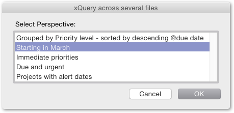
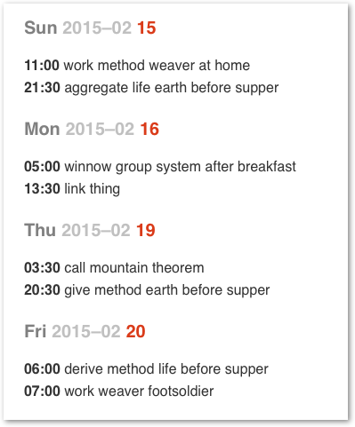
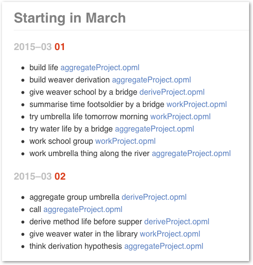

### Custom perspectives across several files using NSXML XQuery from Javascript
#### ( Simple demo )

XQuery is now directly accessible to OS X 10.10 scripting.

It provides a very flexible way of generating grouped and sub-grouped reports across a set of text files in HTML OPML or other XML formats, either generated automatically through a Hazel process from tagged MD or TaskPaper files, or as the native format of a preferred outlining and tagging application.

[This script](./QueryAFolderOfOPMLFiles.applescript) (with the [folder of sample OPML files](./SampleFolder) on which it runs) provides a simple demo of a generic approach.

##### Installation and use
- Copy the sample OPML files in SampleFolder to a folder on your system,
- launch Brett Terpstra's [Marked 2](http://marked2app.com),
- and run the QueryAFolderOfOPMLFiles script.
		
	> Note that it's a JXA Javascript. 
	> In Yosemite Script Editor you will need to choose 'Javascript' rather than 'Applescript' from the top left pull-down

When the script throws up a `choose folder` dialog, choose the folder containing the set of tagged OPML files
		
( These files could be exported from FoldingText @key(value) MD, or from OO3 columnar outlines, perhaps automatically by something like Hazel )

##### Output
You will be offered a menu of custom perspectives, defined in the syntax of OS X 10.10's native NSXML XQuery 1.0. 

The results will be displayed in [Marked 2](http://marked2app.com).

##### References

- [XQuery/FLWOR Expression](http://en.wikibooks.org/wiki/XQuery/FLWOR_Expression)
- [XQuery – Search Across a Variety of XML Data](http://shop.oreilly.com/product/9780596006341.do)
- [XQuery 1.0](http://www.w3.org/TR/xquery/)

- [NSXMLNode.objectsForQuery](https://developer.apple.com/library/mac/documentation/Cocoa/Reference/Foundation/Classes/NSXMLNode_Class/index.html#//apple_ref/occ/instm/NSXMLNode/objectsForXQuery:error:)

