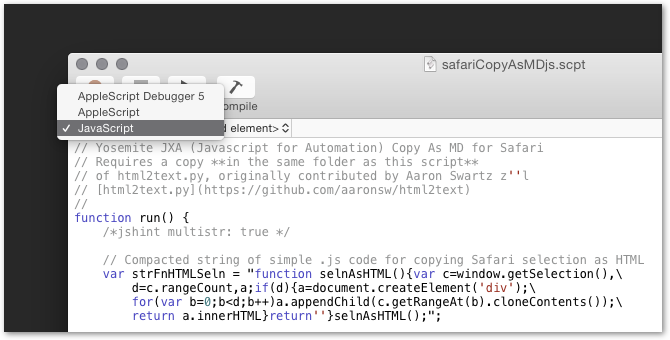
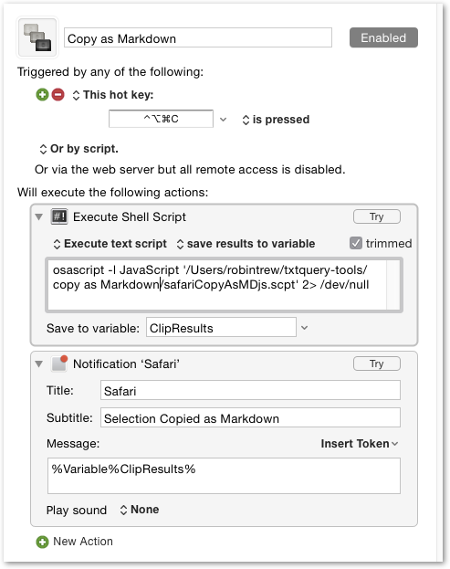

## Copy as MD for Safari (Yosemite)

### Use
- Select some paragraphs in Safari,
- run the script from a keyboard assignment,
- and paste the paragraphs somewhere as [Markdown-formatted](http://daringfireball.net/projects/markdown/syntax) text.

### Requirements
1. OS X 10.10 (Yosemite)
2. [safariCopyAsMDjs.applescript](./safariCopyAsMDjs.applescript) 
		(Written in Yosemite JXA - Javascript for Automation)
3. A copy of the [html2text.py](https://github.com/aaronsw/html2text) Python text file
		(place it in the same folder as [safariCopyAsMDjs.applescript](./safariCopyAsMDjs.applescript))

### Installation
- Use OS X Yosemite Script Editor to save a copy of [safariCopyAsMDjs.applescript](./safariCopyAsMDjs.applescript) as a compiled Javascript .scpt file

		
- Place a copy of the [html2text.py](https://github.com/aaronsw/html2text) text file in the same folder as this script.

- Assign a keyboard shortcut to safariCopyAsMDjs.scpt 
	- with something like [Keyboard Maestro](http://www.keyboardmaestro.com)

			
- or [Fastscripts](http://www.red-sweater.com/fastscripts/) 
