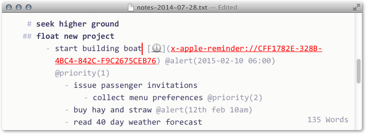

# Plain text - links to and from Reminders [❓](x-apple-reminder://7152DBB4-E6D8-4D59-9B74-65C1CD2819B7)
## Approach
- What ?
	- A set of tools (FoldingText|TaskPaper)
- Why ?
	- Complex work requires a toolkit rather than a single tool.
	- Nothing beats plain text outlines for quickly and flexibly gathering thoughts and building things.
	- Clickable URLs in plain text
		- (with the details tidied Syntax Hiding)
	- give the links to other files,
		- ( in nvAlt, DevonThink or just the file system)
	- and to other resources, such as contacts and reminders.
	- Here is the approach which I am personally using @start(2014-07-24)

## Tools [❓](x-apple-reminder://DB1C40D1-A9A4-442C-80BB-A51E0E8B5DAD)
### Date entry – create date tags quickly [🕑](x-apple-reminder://9F33DCC6-127F-49BF-A0ED-8241C405D5DD) @alert(2014-07-27 14:15)

### PUSH to Reminders.app – automatically create/update linked reminders

#### Installation (see installation details for script and plugins below)
#### Use
Automatically create or update a Reminders.app entry linked to an `@alert(yyyy-mm-dd [H:M])`-tagged line.

The FT line contains a 🕜-labelled link to the newly created Reminders.app entry, and the Reminders entry contains a link back to the FT file and line.

(then running the script again will update the linked Reminder ...)

### PULL from Reminders.app – bring dates, priorities from a linked reminder
### Toggle `@done` at both ends – mark an item as done in FT and in Reminders.app with one click
### Copy as link for Reminders.app – get a link to a pre-existing reminder

# How can we use Reminders with plain text ?
- What is the approach, and why ?
- what are the tools ?
- and how do we use them ?

---

## Get date entry working with TextExpander
- Find the command name
	-  main.js
		- FT
			- Application folder
				- date plugin
- Create an applescript snippet which invokes the control
	- Existing applescript examples
- place the snippet in the relevant tag shortcuts

