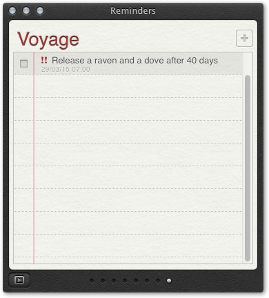
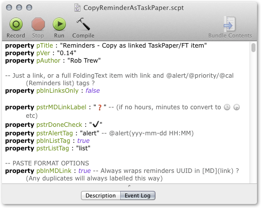
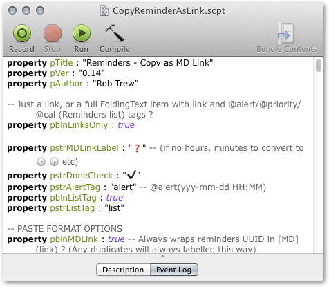
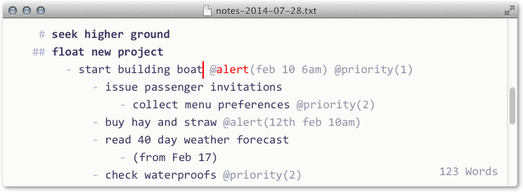
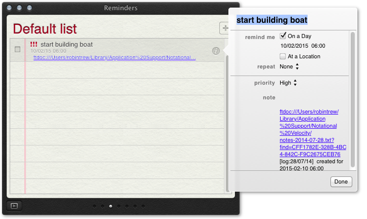
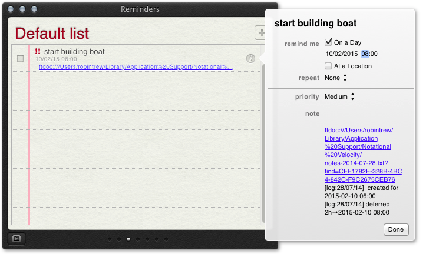

### Plain text project files with links to and from Reminders.app
Nothing beats plain text outlines for quickly and flexibly gathering thoughts and developing project structure, and well synched databases like Reminders.app are very good for automating alerts.

Plain text and Reminders can be linked to each other, and we can script the creation these links (and the exchange of dates and other details between our notes and our reminders).

#### Creating links back and forth between plain text and reminders,

##### Plain text links to alerts in Reminders.app

	
These links are made possible by the [x-apple-reminder://](x-apple-reminder://) URL scheme of Reminders.app

*FoldingText > View > Show Syntax*

				
We can create these links automatically, either copying them from existing Reminders,

as TaskPaper / FoldingText entries, [with this script,](./CopyReminderAsTaskPaperOrFT.applescript)
					

(result with MD link and TaskPaper-style tags)

    - Release a raven and a dove after 40 days  [🕖](x-apple-reminder://144D021C-06D7-4FE0-AE28-76295FDCB08C) @list(voyage) @alert(2015-03-29 07:00) @priority(2)

OR simply as MD links, [with another script.](./CopyReminderAsLink.applescript)
					

					
(Resulting link to a reminder):
					   
    [🕖](x-apple-reminder://144D021C-06D7-4FE0-AE28-76295FDCB08C)

Alternatively, we can automatically push details from plain text entries to create new reminders

1. Select a line which contains an `@alert(date/time) tag (the date/time can be informal or relative) ...
	

2. Run the script [FTMakeOrUpdateReminder.scpt](./FTMakeOrUpdateReminder.applescript) in Applescript Editor
	

	A clock-faced link to a new reminder is created:
		

	and the note of the new reminder also contains a link **back** to the FoldingText entry:
		
				
##### Links from Reminders.app back to plain text
- There are url schemes for linking to particular lines TaskPaper and Foldingtext files,
	- [ftdoc://](https://github.com/RobTrew/txtquery-tools/blob/master/ftdoc%20url%20scheme%20and%20FTCopyAsURL/README.md)
	- [tp3doc://](https://github.com/RobTrew/txtquery-tools/blob/master/tp3doc%20url%20scheme%20and%20TP3CopyAsURL/README.md)
- To download and install these url schemes, see:
	- [FoldingText 2 url scheme ftdoc://](https://github.com/RobTrew/txtquery-tools/blob/master/ftdoc%20url%20scheme%20and%20FTCopyAsURL/README.md)
	- [TaskPaper 3 url scheme tp3doc://](https://github.com/RobTrew/txtquery-tools/blob/master/tp3doc%20url%20scheme%20and%20TP3CopyAsURL/README.md)
		
#### Synching adjusted details

The values of various `@key(value` tags in plain text notes,

- `@alert(yyyy-mm-dd HH:MM)`
- `@priority(1|2|3)`
- `@done(yyyy-mm-dd HH:MM)`
- `@cal(list name)`

can be sent back and forth by script between text and Reminders.app.

- [Pushing details from FoldingText to Reminders](./FTMakeOrUpdateReminder.applescript)
- [Pulling details from Reminders to FoldingText](./FTPullDetailsFROMLinkedReminder.applescript)
- [Toggling @done status at both ends](./FTToggleDoneUpdateReminders.applescript)

1. Make some edits in FoldingText to the value(s) of any @alert or @priority tag(s) 
	
	
	(any new dates or times can be relative or informal)

2. then run the create/update script again.

	The clock-face icon and time display will be normalized in FT:
	
	
	and the linked reminder will be updated to the new time and priority level:

#### Using relative date / time expressions
The update script understands the same set of relative and informal date time expressions as the [Relative dates and date adjustment](../relative%20dates%20and%20date%20adjustments.ftplugin/README.md) plugin for FoldingText.

#### Installation
The applescripts require installation of [smalltime.ftplugin](../smalltime.ftplugin) and [reminder tools.ftplugin](../reminder%20tools.ftplugin) plugins for FoldingText.

- [txtQuery Tools repository](https://github.com/RobTrew/txtquery-tools)
- [Download .zip](https://github.com/RobTrew/txtquery-tools/archive/master.zip)

